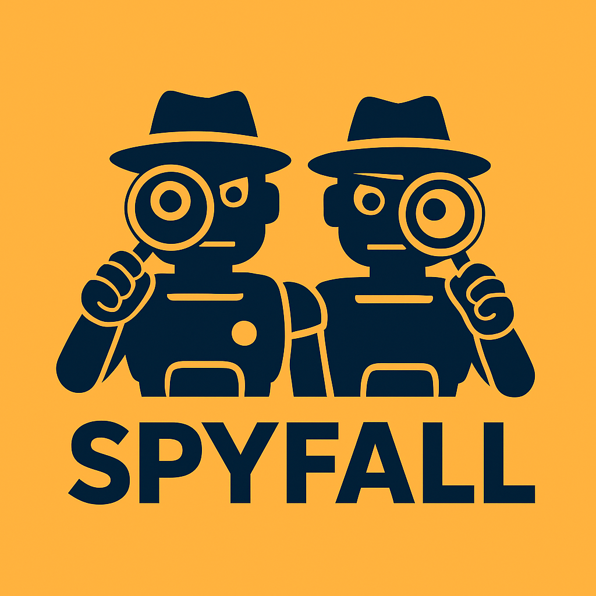

# Long Competition Fall 2025: Spyfall - Double Cross

This is the repository for the 2025 UT Austin MLDS Long Competition where teams will be competing in a game of Spyfall. Teams will submit agents that can use LLMs and embedding models to ask/answer questions and determine the spies/location. The goal of this Long Competition is to show your LLM prompting/natural language processing skills.

## Game Rules

**<u>Setup</u>**: Each game is played with 5-10 players. All players are given the location except for the spies. The spies do not know each other and are competing against each other.

**<u>Spy Objective</u>**: The spies must figure out the location without revealing their identity.

**<u>Non-Spy Objective</u>**: Players must figure out who one of the spies is.

**<u>Gameplay</u>**: Each game consists of a fixed number of rounds. In each round, the following happens:

1. **<u>Questioning</u>**: A random player starts by asking another player a question about the location. The player who answers the question will be the one to ask the question in the next round. You can ask a question to any player except the player who asked you a question the previous round.

   Ex: A --> B --> A is not allowed.
2. **<u>Questioning Analysis</u>**: All players are given time to analyze the question/answer.
3. **<u>Guessing</u>**: The spies may guess the location. This will end the game. If both spies guess, the order is randomized.
4. **<u>Accusation</u>**: Players may accuse another player of being the spy. Successfully indicting a player will end the game. For a player to be indicted, the following conditions must be met:
   * A majority of the players must accuse *any* player.
   * One player must get a plurality of the votes. If a tie occurs, nothing happens.

    Ex: If 2 players accuse player A, 1 player accuses player B, 1 player accuses player C, and 3 players do not vote, player A is successfully indicted.

5. **<u>Voting Analysis</u>**: Players can see who voted for who and are given time to analyze the votes.

**<u>The game ends when</u>**:

* A spy guesses the location.
* A player is indicted of being a spy.
* All rounds are completed.

**<u>Scoring</u>**:

| Event                     | Points                        |
| ------------------------- | ----------------------------- |
| No guesses or indictments | 2 to each spy                 |
| Spy guesses correctly     | 4 to that spy                 |
| Spy guesses incorrectly   | 1 to all others               |
| Spy indicted              | 1 to nonspies, 4 to other spy |
| Non-spy indicted          | 3 to each spy                 |


## Getting Started

**<u>Setting up the Code</u>**:

To run this project locally with conda, run the following commands. This may take a while.

``` bash
conda create -n long_comp python==3.10.13 -y
conda activate long_comp
pip install -r requirements.txt
```

If you do not have conda installed, you can install it [here](https://docs.anaconda.com/miniconda/). Additionally, if you use VSCode, the VSCode Extension `Python Environment Manager` by Don Jayamanne is nice for managing and selecting default conda environments.

If you use additional packages, please add them to `requirements.txt`.

*Note: this repository is thoroughly type-annotated. To catch type errors, you can install the VSCode Extension `Mypy Type Checker` by Microsoft.*

**<u>Setting up Your API Key</u>**:

We will be using [Google Vertex AI](https://console.cloud.google.com/freetrial/?redirectPath=/vertex-ai) which offers $300 in free credits. A credit card is required but only to verify identity.

***You will not be charged unless you explicitly upgrade your account.***

1. Login to your Google account
2. Enter your credit card information (again, you will not be charged)
3. Click agree/enable to all pop-ups
4. Click on "My First Project" at the top left and select "New project"
5. Create a new project called "long-comp-fall-2025"
6. Install gcloud cli and login with the following commands. Click "enter" when prompted for a path, "y" to update your $PATH, and "n" to install Python 3.12.

``` bash
curl https://sdk.cloud.google.com | bash
exec -l $SHELL
gcloud auth application-default login
gcloud auth application-default set-quota-project long-comp-fall-2025
```

**<u>Verifying Billing is Setup</u>**:

***After setting up your credit card information, you must link it to your project by checking if billing has been enabled. (Note this is not automatic and should be checked as follows)***
1. Run this to confirm billing is active for your project:
``` bash
gcloud beta billing projects describe long-comp-fall-2025
```
2. You should see output containing: 
``` bash
billingEnabled: true
```
3. If billingEnabled: false, then go to Google Cloud Console → Billing → Manage Billing Accounts → Link to Project and attach your billing account.

**<u>Running Games/Simulations</u>**:

See `main.py` for an example of how to run games and simulations.

*Note: by default, a dummy llm and embedding model are selected. You can change this at the top of `main.py`.*

**<u>Submitting Your Agent</u>**:

Write your agent in `submission.py` and use `@register_agent(<team name here>)` to register your agent under your team name. Also, please put your team member's name/emails/EIDs in a comment at the top. You can name your class anything you want. Commit and push `submission.py` and any other files you added to the GitHub Classroom repository.

## Rules

* Besides `submission.py`, `requirements.txt`, and any added files, do not modify any other files in the repository. For instance, do not change `data.py`. If you need to store data, use a separate file.
* Prompt injections are allowed.
* You may not use any NLP models outside what is provided.
